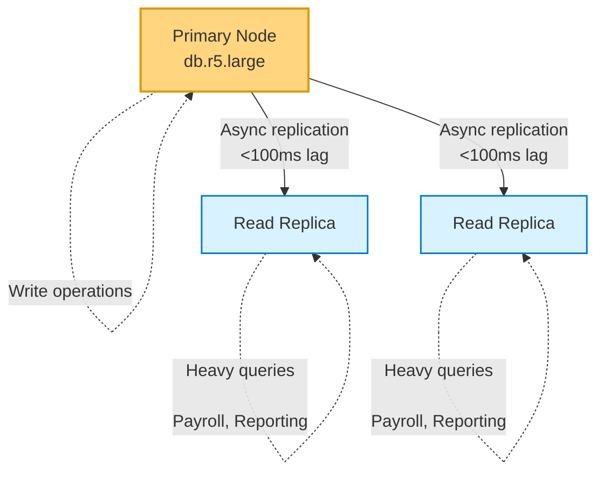

## TLDR;

This document analyzes three architecture options for redesigning the infrastructure of four core services, focusing on cost and performance optimization.
Based on an in-depth analysis, **Scenario 3 (AWS Optimized with Savings Plans)** is recommended as the best solution, with a total cost of **$355.46/month** for both production and staging.
This yields **71% savings** compared to Fly.io and **54% savings** compared to an unoptimized AWS setup.

### Key Recommendations

* **Production:** AWS with Lambda/Fargate + DocumentDB + Savings Plans
* **Staging:** AWS with Spot Instances and scaled-down resources
* **Estimated Total:** $355.46/month (Production: $260.17, Staging: $95.29)
* **ROI:** 54–71% cost reduction with stable performance

---

## 1. Background & Problems

### 1.1 Current State

The system runs on a **microservices architecture** with two environments (staging and production) using:

* **AWS** as the main provider (Lambda and ECS)
* **Fly.io** for some management services (partial migration)
* **Onidel** under trial for development/staging

### 1.2 Current Issues

* **High AWS Cost:** Monthly operational expenses are not optimized due to lack of resource optimization and absence of commitment-based pricing.
* **High Latency on Fly.io:** Services deployed on Fly.io suffer from significant slowdowns because the database remains on AWS, resulting in cross-provider egress and network latency (**40ms+ overhead per query**).
* **Multi-Provider Complexity:** Managing infrastructure across multiple cloud providers increases operational overhead and troubleshooting complexity.
* **Expensive Staging Environment:** Staging uses the same resource configuration as production without scaling down.

---

## 2. Assignment Scope: 4 Core Components

### 2.1 CRUD / Management Service

**Characteristics:**

* Standard data management service
* Traffic pattern: moderate and predictable
* Workload: read-heavy with occasional writes

**Recommended Architecture:**

* AWS Lambda with 512MB–1GB memory
* Estimated 5M requests/month, 200ms average duration
* Auto-scaling based on request volume

---

### 2.2 Payroll Service (Heavy Processing)

**Characteristics:**

* Payroll processing for ±3,000 employees
* Data per employee: ±100 documents/month + ±10 aggregations
* Load distribution: 50% app/engine, 50% database queries
* Already uses batching/queue mechanisms

**Recommended Architecture:**

* **AWS Fargate Configuration:**

  * 2 vCPU, 8GB RAM for batch processing
  * Running time: ~100 hours/month (batch jobs)
  * AWS SQS for job management
  * Read-only DocumentDB replica for direct queries

**Processing Strategy:**

* Batch processing with chunk size 100–200 employees
* Parallel processing using queue workers
* Database connection pooling for efficiency

---

### 2.3 Reporting / PDF Generation Service

**Characteristics:**

* Generates PDF reports with embedded images
* Already uses batching and queues
* Resource-intensive due to image rendering

**Recommended Architecture:**

* AWS Fargate with 1 vCPU, 4GB RAM
* Running time: ~80 hours/month
* AWS SQS for queue system
* S3 for temporary and final PDF storage

---

### 2.4 Database (NoSQL – DocumentDB)

**Characteristics:**

* NoSQL database (MongoDB-compatible)
* Planned deployment: 3-node replica set

  * 1 primary (write operations)
  * 2 read replicas (for payroll and reporting)

**Recommended Architecture:**

* **Amazon DocumentDB:**

  * Primary: db.r5.large (2 vCPU, 16GB RAM)
  * 2× Read Replicas: db.r5.large
  * Storage: 500GB with auto-scaling
  * I/O-Optimized configuration for predictable costs

**Read/Write Separation:**

* Writes → Primary instance
* Heavy queries (payroll, reporting) → Read replicas
* Typical replica lag: <100ms

---

## 3. Tech Stack Analysis

### 3.1 Backend Stack

**Current Stack:**

* PHP (Phalcon)
* Node.js (NestJS, Express)
* Scala (used for bulk/inline editing – planned migration to JS)

**Future Direction:**

* **Target:** Standardize on Node.js/NestJS for consistency
* **Benefit:** Easier deployment to AWS Lambda and Fargate

---

### 3.2 Frontend

* Static hosting on **S3** with **CloudFront CDN**
* Cost-effective solution with built-in scalability

---

## 4. Architecture Options Comparison

### Scenario 1A: AWS Lambda + Fargate Hybrid (Production Only)

**Architecture:**

* CRUD Service → AWS Lambda
* Payroll/Reporting → AWS Fargate (batch processing)
* Database → DocumentDB (3-node replica set)
* Frontend → S3 + CloudFront

**Cost Breakdown (Production):**

| Component         | Cost (USD/month)  |
| ----------------- | ----------------- |
| CRUD Management   | $2.47             |
| Payroll Service   | $11.65            |
| Reporting Service | $4.66             |
| Database          | $696.63           |
| Frontend          | $8.73             |
| Data Transfer     | $50.00            |
| **Total**         | **$774.14/month** |

**Pros:**

* Flexible auto-scaling
* Pay-per-use model for sporadic workloads
* Native AWS integration

**Cons:**

* No staging environment included
* Database cost dominates (~90% of total)
* No commitment-based discounts applied

---

### Scenario 2: Fly.io (Production) + Onidel (Staging)

**Architecture:**

* **Production Services:** Fly.io instances
* **Database:** AWS DocumentDB (cross-provider)
* **Staging:** Onidel VPS

**Cost Breakdown:**

**Production (Fly.io):**

| Component               | Cost (USD/month)          |
| ----------------------- | ------------------------- |
| CRUD                    | $21.40 (2× Shared-CPU-1x) |
| Payroll                 | $85.58 (2× Shared-CPU-4x) |
| Reporting               | $42.80 (2× Shared-CPU-2x) |
| Database (AWS)          | $696.63                   |
| Cross-provider Transfer | $150.00                   |
| Frontend                | $5.00                     |
| **Production Total**    | **$1,001.41**             |

**Staging (Onidel):**

| Component             | Cost (USD/month) |
| --------------------- | ---------------- |
| App Servers           | $19.80 (ONI-3)   |
| Database (AWS scaled) | $221.48          |
| **Staging Total**     | **$241.28**      |

**Grand Total:** **$1,242.69/month**

**Pros:**

* Fly.io offers global edge deployment
* Onidel provides affordable staging
* Simple developer experience

**Cons:**

* 71% more expensive than optimized AWS
* Cross-provider latency (40–50 ms overhead per query)
* High egress cost (~$150/month Fly.io ↔ AWS traffic)
* Database remains a major cost center
* Complex multi-cloud networking
* Limited co-location benefits for database access

---

### Scenario 3: AWS Optimized + Savings Plans (**Recommended**)

**Architecture:**
Same as Scenario 1A, but with:

* **Compute Savings Plans:** 66% discount on Lambda/Fargate
* **Reserved Instances:** 72% discount on DocumentDB
* **Spot Instances (Staging):** 70% discount

**Cost Breakdown:**

**Production:**

| Component                     | Cost (USD/month) |
| ----------------------------- | ---------------- |
| CRUD (Lambda + Savings)       | $0.84            |
| Payroll (Fargate + Savings)   | $3.96            |
| Reporting (Fargate + Savings) | $1.58            |
| Database (Reserved)           | $195.06          |
| Frontend                      | $8.73            |
| Data Transfer                 | $50.00           |
| **Production Total**          | **$260.17**      |

**Staging (Spot Instances):**

| Component         | Cost (USD/month) |
| ----------------- | ---------------- |
| Compute           | $1.69            |
| Database          | $83.60           |
| Data Transfer     | $10.00           |
| **Staging Total** | **$95.29**       |

**Grand Total:** **$355.46/month**

**Pros:**

* Lowest total cost — 71% cheaper than Fly.io
* Predictable pricing with commitment discounts
* Zero cross-provider latency
* Full AWS-native integration across all services
* Flexible staging via Spot Instances
* Best performance with same-region database access

**Cons:**

* Requires 1–3 year commitments for maximum savings
* Monitoring needed for Spot Instance interruptions (staging only)
* Slightly less developer-friendly than Fly.io

---

## 5. Database Strategy: 3-Node Replica Set

### 5.1 Architecture

### 5.2 Read/Write Separation Benefits

**Write Operations (Primary):**

* CRUD operations
* User transactions
* Real-time updates

**Read Operations (Replicas):**

* Payroll processing (heavy aggregations)
* Report generation
* Analytical queries

**Performance Impact:**

* Replica lag: typically <100 ms
* Eliminates read contention on the primary node
* Scales read capacity independently

> **Production footprint:** 3 nodes ≈ 606 hours total compute time.

---

## 6. Staging Environment Strategy

### 6.1 Recommended Approach (Scenario 3)

**Resource Scaling:**

* Compute: 30 % of production capacity
* Database: 2-node cluster (1 primary + 1 replica)
* Storage: 100 GB (vs 500 GB in production)

**Cost Optimization:**

* Use **Spot Instances** for ~70 % discount
* **Auto-shutdown** during non-business hours (up to 60 % extra savings)
* Shared resources for non-critical services

---

### Alternative: Onidel for Staging

* **Cost:** $19.80/month for compute
* **Pros:** Extremely affordable, suitable for testing
* **Cons:** Still requires AWS DocumentDB ($221.48) → total $241.28 vs $95.29 on AWS Spot Instances

---

## 7. Migration & Implementation Strategy

### 7.1 Phase 1 – Database Optimization (Week 1 – 2)

1. **Setup DocumentDB Replica Set:**

   * Deploy 3-node cluster in the same AZ/region
   * Configure read endpoints
   * Test replication lag

2. **Application Modifications:**

   * Update connection strings for read/write separation
   * Implement connection pooling
   * Add retry logic for replica lag handling

---

### 7.2 Phase 2 – Compute Optimization (Week 3 – 4)

1. **Lambda Migration for CRUD Services:**

   * Package NestJS apps for Lambda
   * Configure API Gateway
   * Test cold-start performance

2. **Fargate Setup for Batch Jobs:**

   * Containerize payroll and reporting services
   * Configure SQS queues
   * Implement batch processing logic

---

### 7.3 Phase 3 – Savings Plans & Cost Optimization (Week 5)

1. Analyze usage patterns (minimum 7 days)
2. Purchase **Compute Savings Plans** (1-year term recommended)
3. Purchase **DocumentDB Reserved Instances** (1-year term)
4. Configure staging with Spot Instances

---

### 7.4 Phase 4 – Monitoring & Tuning (Week 6)

1. **CloudWatch Dashboards for:**

   * Lambda execution metrics
   * Fargate CPU / memory utilization
   * DocumentDB replica lag
   * Queue depths

2. **Cost Tracking:**

   * AWS Cost Explorer
   * Tag-based cost allocation
   * Monthly spend reviews

---

## 8. Cost Comparison Summary

| Scenario                             | Production | Staging | Total     | vs Scenario 3 |
| ------------------------------------ | ---------- | ------- | --------- | ------------- |
| **1A: AWS Hybrid (No Optimization)** | $774.14    | $0.00   | $774.14   | +118 %        |
| **2: Fly.io + Onidel**               | $1,001.41  | $241.28 | $1,242.69 | +250 %        |
| **3: AWS Optimized (Recommended)**   | $260.17    | $95.29  | $355.46   | Baseline      |

---

## Key Savings

* **vs No Optimization:** $418.68/month (54% reduction)
* **vs Fly.io:** $887.23/month (71% reduction)
* **Annual Savings:** $5,024–$10,647

---

## 9. Risk Assessment

### Scenario 1A – AWS Hybrid (No Optimization)

**Risks:**

* High ongoing costs without commitment-based discounts
* Cost unpredictability due to pure pay-as-you-go pricing
* No staging environment → production-only testing

**Mitigation:**

* Migrate to **Scenario 3** for immediate savings

---

### Scenario 2 – Fly.io + Onidel

**Risks:**

* Cross-provider latency: 40–50 ms per query
* High egress costs: $150/month, with potential for increase
* Database bottleneck: all services access AWS DocumentDB from Fly.io
* Complex troubleshooting across multiple providers

**Mitigation:**

* Not recommended for this production workload
* Only viable if the database is migrated to a Fly.io region (currently unavailable for DocumentDB)

---

### Scenario 3 – AWS Optimized (**Recommended**)

**Risks:**

* Requires 1-year Savings Plans commitment
* Potential interruptions for Spot Instances (staging only)
* Architecture changes involve migration effort

**Mitigation:**

* Start with a **1-year commitment** (lower risk than 3-year)
* Use **Spot Instances only for staging** (production remains on On-Demand)
* Implement **graceful shutdown handlers** for Spot Instances
* Conduct phased migration with rollback plan

---

## 10. Final Recommendation

### **Primary Recommendation:** Scenario 3 (AWS Optimized)

**Rationale:**

1. Lowest total cost: **$355.46/month**
2. Best performance: zero cross-provider latency
3. Predictable pricing through Savings Plans
4. Proven stability using AWS-managed services
5. Scalable architecture for future growth

**Implementation Timeline:**

| Week | Activity                             |
| ---- | ------------------------------------ |
| 1–2  | Database replica set setup           |
| 3–4  | Compute migration (Lambda / Fargate) |
| 5    | Purchase Savings Plans               |
| 6+   | Monitoring & Optimization            |

---

### **Alternative Option:** Scenario 1A

If a Savings Plans commitment isn’t feasible yet:

1. Start with **Scenario 1A ($774.14/month)**
2. Monitor usage for 30–60 days
3. Migrate to **Scenario 3** once usage patterns stabilize

---

### **What NOT to Do**

Avoid **Scenario 2 (Fly.io)** for this workload because:

* Database remains on AWS (71 % more expensive)
* Cross-provider latency > 40 ms per query
* High egress costs ($150/month)

---

## 11. Assumptions & Limitations

### **Load Assumptions**

* 3,000 employees for payroll processing
* 100 documents + 10 aggregations per employee per month
* 5 million requests per month for CRUD operations
* 500 GB database storage for production
* 200 million I/O operations per month for database

---

### **Analysis Limitations**

* Pricing based on **ap-southeast-1 (Singapore)** region
* Does **not include** compliance / security add-ons
* Does **not include** disaster recovery costs
* Staging assumes **30 % of production load**

---

### **Pricing Notes**

* AWS pricing as of **October 2025**
* Fly.io pricing based on latest documentation
* Onidel pricing from official website

---

## 12. Next Steps

### **Technical Preparation**

1. Audit current **AWS usage** to establish a performance and cost baseline
2. Document the **existing architecture**
3. Prepare a detailed **migration runbook**
4. Set up the **staging environment** for testing and validation

---

### **Questions**

1. Is a **1-year Savings Plans commitment** acceptable?
2. Are there any **compliance requirements** not yet covered?
3. Can the **staging environment tolerate Spot Instance interruptions**?
4. What is the **preferred timeline** for the production migration?

---

